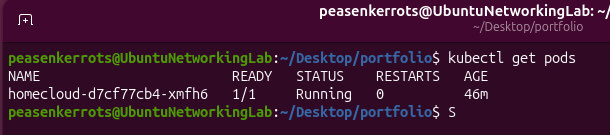
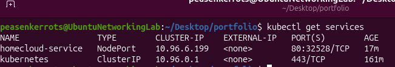

# KubeForge HomeCloud

## Overview

KubeForge HomeCloud is a containerized web application deployed to a local Kubernetes cluster using Docker, Kind, and Kubernetes.

The project demonstrates the complete workflow of:

* Building a custom Docker image
* Running a local Kubernetes cluster with Kind
* Deploying an application using a Kubernetes Deployment
* Exposing the application using a Kubernetes Service
* Accessing the application through Kubernetes networking

This project was built as a hands-on introduction to containerization and Kubernetes orchestration.

---

## Technologies Used

* Docker
* Kubernetes
* Kind (Kubernetes in Docker)
* NGINX
* YAML
* Ubuntu Linux

---

## Architecture

```text
Browser
    ↓
Kubernetes Service
    ↓
Pod
    ↓
Docker Container
    ↓
NGINX
    ↓
Static Website
```

---

## Project Structure

```text
portfolio/
├── Dockerfile
├── index.html
├── deployment.yaml
└── service.yaml
```

### Dockerfile

Builds a custom Docker image using NGINX and serves the project's custom HTML page.

### index.html

Static website content.

### deployment.yaml

Defines the Kubernetes Deployment responsible for running the application Pod.

### service.yaml

Defines the Kubernetes Service used to expose the application inside the cluster.

---

## Deployment Workflow

### 1. Build Docker Image

```bash
docker build -t kubeforge_homecloud .
```

### 2. Create Kubernetes Cluster

```bash
kind create cluster --name homecloud
```

### 3. Load Image Into Kind

```bash
kind load docker-image kubeforge_homecloud --name homecloud
```

### 4. Deploy Application

```bash
kubectl apply -f deployment.yaml
```

### 5. Create Service

```bash
kubectl apply -f service.yaml
```

### 6. Verify Deployment

```bash
kubectl get pods
kubectl get services
```

---

## Screenshots

### Kubernetes Pod Running



**Screenshot:** Output of:

```bash
kubectl get pods
```

Demonstrates that the HomeCloud application is successfully running inside Kubernetes.

---

### Kubernetes Service



**Screenshot:** Output of:

```bash
kubectl get services
```

Demonstrates that the application has been exposed through a Kubernetes Service.

---

### Application Running


**Screenshot:** Browser window displaying the deployed webpage.

Demonstrates successful end-to-end connectivity from client to Kubernetes Service to Pod.

---

## Key Kubernetes Concepts Demonstrated

### Pod

The smallest deployable unit in Kubernetes. The HomeCloud application runs inside a Pod.

### Deployment

Responsible for creating and maintaining the desired number of application Pods.

### Service

Provides a stable endpoint for accessing Pods and routing traffic to the application.

### Cluster

A local Kubernetes cluster created with Kind and managed through kubectl.

---

## What I Learned

Through this project I gained practical experience with:

* Building Docker images
* Containerized application deployment
* Kubernetes cluster creation
* Kubernetes Deployments
* Kubernetes Pods
* Kubernetes Services
* Application exposure and networking
* Basic Kubernetes troubleshooting and debugging

---


* Additional containerized services
* CI/CD pipeline integration
